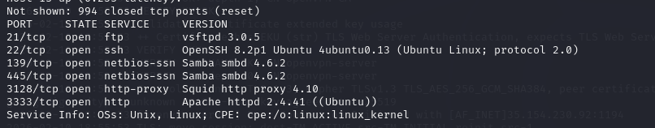
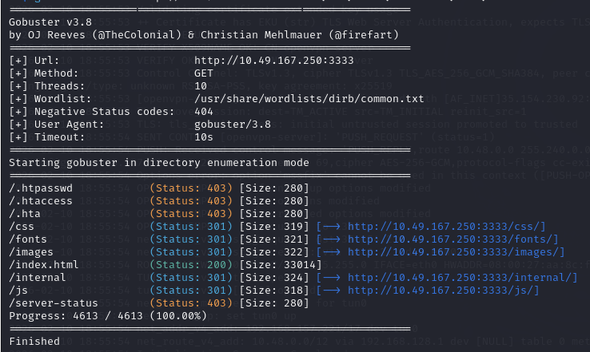

# TryHackMe – Vulnversity Write-up

### Nmap Scan
```bash
 nmap -sV <IP address>
 ```



### Directory enumeration 
```bash
 gobuster dir -u http://<IP address> -w /usr/share/wordlists/dirb/common.txt
``` 

### Web Inspection
```bash
 firefox http://10.49.167.250:3333/internal/    
```

### fuzz the upload form
 the wordlist: 
```bash
 echo -e "php\nphp3\nphp4\nphp5\nphtml" > extensions.txt
 ```
